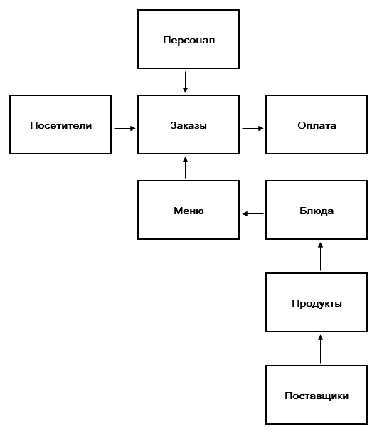
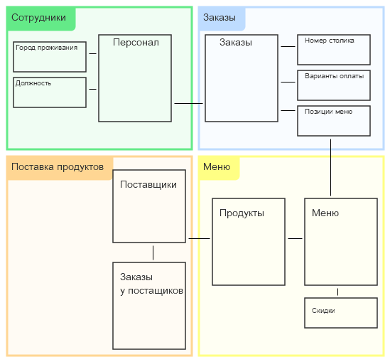
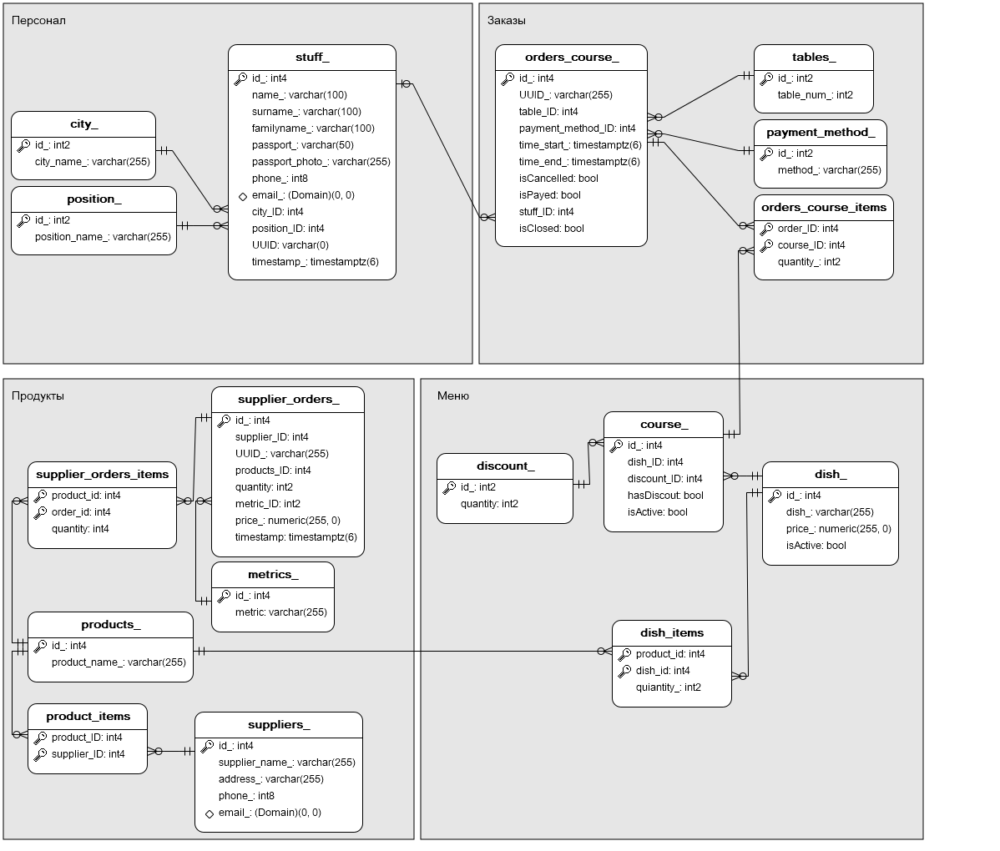
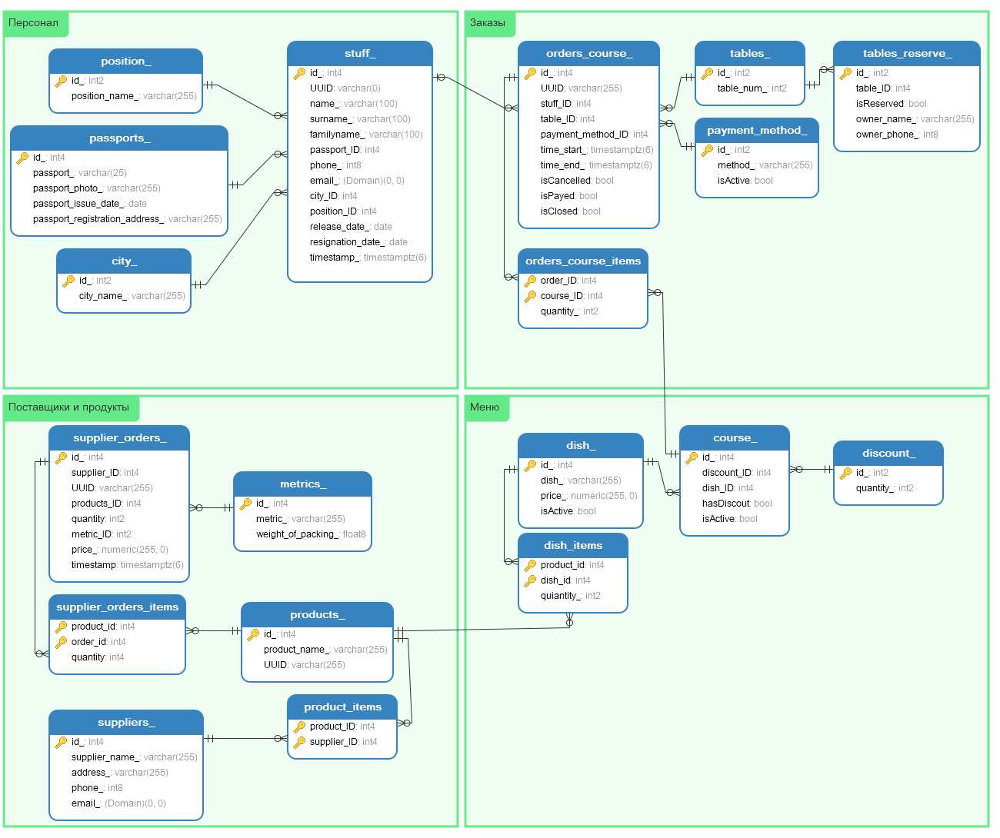

## Построение модели данных

#### 1. "Заказ в ресторане"

За основу возьмем вариант №1 - "Заказ в ресторане". Нарисуем схему бизнес-процессов.

Ресторан разрабатывает меню (`меню`), состоящее из блюд. При разработке меню определяются необходимые ингридиенты (`продукты`) для приготовления, которые ресторан приобретает у поставщиков (`поставщики`). В меню ресторана могут быть разнообразные блюда (`блюда`), при этом эти блюда не всегда могут быть доступны, а некоторым посетителям могут быть предложены какие-то позиции, которые ресторан готовит, но они не входят в основное меню. Какие-то блюда из меню могут предлагаться клиентам со скидкой. Посетитель (`посетитель`) ресторана занимает определенный столик, который обслуживает один из официантов (`персонал`). В процессе обслуживания формируется заказ (`заказы`), который оплачивает клиент (`оплата`).

Определим основные сущности в проектируемой БД, при этом расширим нашу схему:

- посетитель
- заказ
  - состав счета
  - варианты оплаты
  - обслуживаемый столик
- меню
  - блюда
  - скидки
- блюдо
  - состав продуктов
  - стоимость
  - скидка
- продукты
  - количество
  - единицы измерения
- поставщики
  - список поставщиков
  - заказ продуктов
- персонал
  - город проживания
  - занимаемая должность

Составляем на основе новой схемы таблицы, которые лягут в основу БД. Отметим, что мы можем хранить все сведения в в состве таблиц, которые мы можем создать уже на основе первой схемы. Однако, с течением времени, при заполнении БД данным, неудобно будет извлекать данные из БД. Улучшаем нашу схему.

#### 2. Нормализация и декомпозиция данных

**Персонал:**
- Таблица `stuff_`, содержит список сотрудников ресторана. С ней будут связаны три таблицы:
    - `city_` - содержит список городов, в которых проживают сотрудники ресторана.
    - `position_` - содержит список должностей организации
    - `passport_` - содержит паспортные данные сотрудников

**Заказы:**
- Таблица `orders_course_`, таблица заказов, так же может содержать все сведения о заказе. Но, во первых заказов может быть очень много, вдруг мы станем новым McDonalds :), заказы могут быть оплачены разными способами, в одном заказе может быть несколько блюд.
  - `tables_` - список столиков
    - `tables_reserve_` - столик может быть зарезервирован клиентом
  - `payment_method_` - таблица содержит возможные способы оплаты
  - `orders_course_items` - предназначена для того, что бы в одном заказе могло быть несколько позиций

**Меню:**
- Таблица `course_` - текущее активное меню ресторана, добавляем
  - `dish_` - таблица блюд заведения
    - `dish_items` - таблица продуктов из которых составлено блюдо
  - `discount_` - таблица возможных скидок на блюда

**Продукты:**
- Таблица `supplier_orders_` - содержит в себе сведения о продуктах и поставщиках продуктов
  - `supplier_orders_items` - служебная таблица для обеспечения нескольких позиций в заказе
  - `product_items` -таблица для связывания поставщика и продуктов, которые он предоставляет ресторану
- Таблица `products_` - содержит в себе названия продуктов
- Таблица `metric_` - содержит единицы измерения
- Таблица `suppliers_` - содержит сведения о поставщике

В результате получаем следующую схему данных:

Состав каждой таблицы и набор полей описан в [ДЗ #02](https://github.com/kakoka/otus-rdbms/tree/master/hw02).
