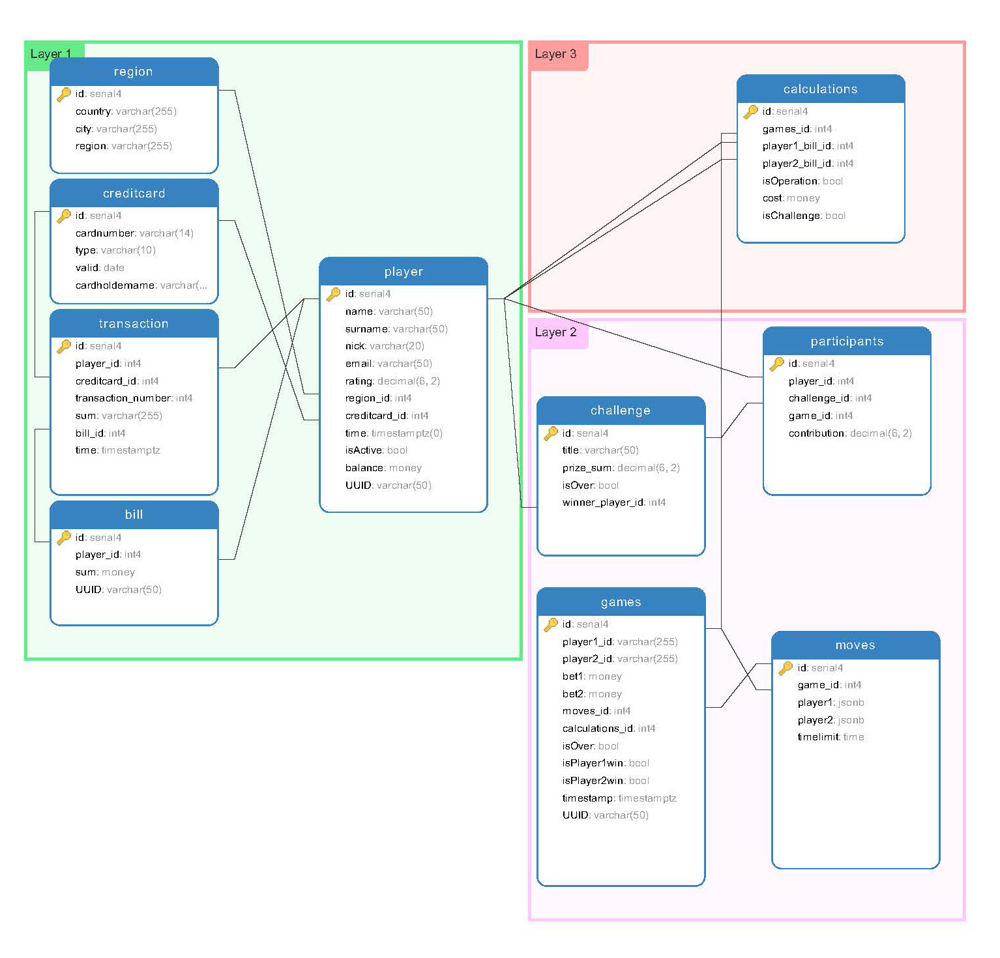

## Шахматное он-лайн казино

Лучший пример для обучения программированию и проектированию, как известно - шахматы. Поэтому в качестве проекта выберем тематику близкую к этой древней игре. Назовем проект - "Шахматное он-лайн казино". 

Суть проекта состоит в следующем: мы создаем сервис, где люди могут играть в шахматы на деньги.
Сервис предоставляет пользователям следующие возможности:

- они могут играть друг с другом в зависимости от рейтинга
- они могут участвовать в турнирах
- они могут играть с искусственным интеллектом
- они могут получать информационные услуги

Условия игр могут быть следующие: 

1. Сначала люди играют на рейтинг, который должен быть сформирован аналитическим алгоритмом в результате некоторого количества тестовых игр, как с ИИ так и с пользователями, имеющими высокий рейтинг и готовыми участвовать за определенное вознаграждение в играх с новичками сервиса. 
2. По достижении определенного рейтинга пользователь может играть с такими же пользователями, которые обладают сопоставимым рейтингом, но только если они сделают ставки
3. Сумма ставок составляет призовой фонд, который в случае победы зачисляется на счет победителя, в случае ничьей - все остаются при своих. Казино имеет очень небольшой процент с выигранных денег (за предоставление услуг)
4. Пользователи могут принимать участия в турнирах, сделав обязательный вступительный взнос. Из взносов формируется призовой фонд, что-то к нему может добавить наше онлайн-казино (если оно организатор, к примеру). 
5. Пользователь может играть так же и с ИИ казино, сделав ставку. Конечно, мы договоримся с IBM и подключим к нашему сервису DeepBlue, что бы казино могло быть прибыльным :) 
...
итд

Мы, как организаторы казино, получим доступ к "черному аналитическому ящику", конечно же от IBM, который будет анализировать прошедшие игры, и на основе этого анализа будет вычисляться рейтинг игроков. Казино наше будет международным проектом (со всеми вытекающими отсюда последствиями), поэтому оно будет иметь свои площадки в разных регионах. Соответственно, казино ведет финансовые дела в основном через интернет. Каждый пользователь обладает личным кабинетом, в котором отражаются основные показатели: финансовый счет, количество игр, результаты, рейтинг, история транзакции, аналитические рекомендации по улучшению рейтинга (конечно за $$$). 

Требования к СУБД будут предположительно следующие:

- БД должна поддерживать мультиязычность
- БД должна уметь работать с большим количеством маленьких транзакций (OLTP) 
	- запись статистики игр
	- запись финансовых операций
- БД должна быть отказоустойчивой
- БД должна поддерживать тяжелые запросы (аналитика, OLAP)
- БД должна иметь актуальную копию и журналы для восстановления на нужный момент времени
- БД должна уметь передавать суточные изменения в вышестоящую БД

На нашей схеме обозначены основные блоки

- Layer1 Схема таблиц, содержащий личные данные пользователей
- Layer2 Схема таблиц, содержащая данные о проведенных играх и их результатах
- Layer3 Схема таблиц, содержащая данные о взаиморасчетах между пользователями и казино

